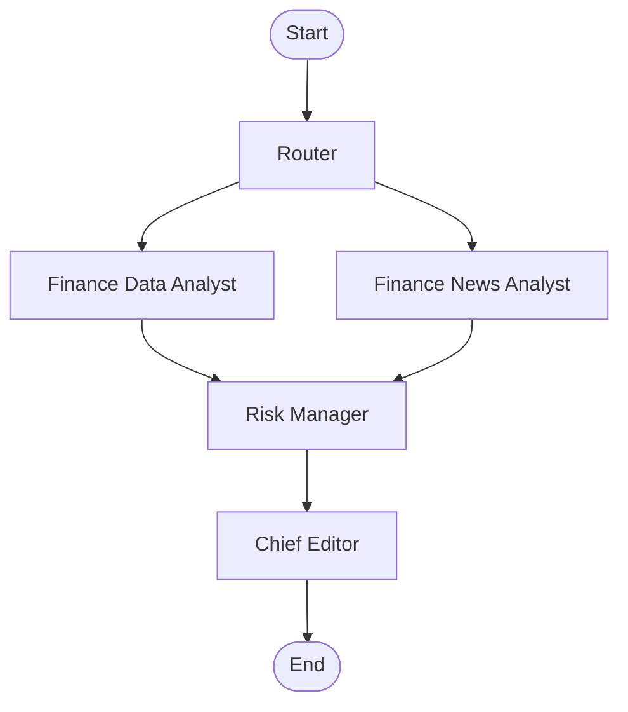

# 🤖 Multi-Agent Investment Research Assistant

**A professional, agentic AI system for comprehensive investment analysis.**

Built with the latest **LangChain v1.0+** and **LangGraph v1.0+**, this assistant orchestrates a team of specialized AI agents to perform deep-dive research, analyze financial data, synthesize news sentiment, and assess risks—delivering a professional-grade investment memo in **Traditional Chinese (繁體中文)**.

---

## 🚀 Features

-   **Multi-Agent Architecture**: Leverages a supervisor-worker pattern with specialized roles (Router, Data Analyst, News Analyst, Risk Manager, Chief Editor).
-   **Traditional Chinese Output**: All reports and analysis are generated in Traditional Chinese (繁體中文) for local context.
-   **Structured Reports**: Agents produce highly structured outputs (Valuation, Financial Health, Market Debate, Catalysts) rather than generic summaries.
-   **Real-time Data**: Fetches live market data using `yfinance`.
-   **News Analysis**: Searches and summarizes recent news using `duckduckgo-search`.
-   **Risk Assessment**: Dedicated agent for identifying downside risks, volatility, and "bear cases".
-   **Modern Tech Stack**: Built on the latest LangChain and LangGraph APIs (v1.0+), using `uv` for lightning-fast package management.

## 📸 Screenshots

| Input Interface | Market Dashboard | Investment Report |
| :---: | :---: | :---: |
|  |  |  |

## 📊 Workflow



## 🤖 Agent Roles

1.  **Router**: Analyzes your query to identify stock tickers and user intent.
2.  **Finance Data Analyst**: Performs rigorous quantitative analysis:
    -   **Valuation**: P/E, PEG, EV/EBITDA, DCF hints.
    -   **Financial Health**: Margins, ROE, Balance Sheet strength.
    -   **Growth**: Revenue and Earnings growth trajectories.
3.  **Finance News Analyst**: Scours the web for qualitative insights:
    -   **Market Debate**: Bull vs. Bear arguments.
    -   **Catalysts**: Upcoming product launches, earnings, or regulatory events.
    -   **Sentiment**: Market sentiment scoring.
4.  **Risk Manager**: Acts as the "Devil's Advocate", synthesizing data to flag potential downside risks, macro headwinds, and competitive threats.
5.  **Chief Editor**: Compiles all insights into a structured, narrative-driven Investment Memo, ensuring professional tone and clarity.

## 🛠️ Prerequisites

-   **Python 3.11+**
-   **[uv](https://github.com/astral-sh/uv)** (Fast Python package installer and resolver)
-   **OpenAI API Key** (or Google Gemini API Key)

## 📦 Installation

1.  **Clone the repository**:
    ```bash
    git clone <repository-url>
    cd agent_investment_sup
    ```

2.  **Install dependencies using `uv`**:
    ```bash
    uv sync
    ```
    This creates a virtual environment in `.venv`.

3.  **Configure Environment**:
    Create a `.env` file in the root directory:
    ```bash
    # OpenAI (Default)
    OPENAI_API_KEY=sk-...
    LLM_PROVIDER=openai
    LLM_MODEL=gpt-4o

    # Google Gemini (Optional)
    # GOOGLE_API_KEY=AI...
    # LLM_PROVIDER=google
    # LLM_MODEL=gemini-1.5-pro
    ```

## ⚙️ Configuration

| Variable | Description | Default |
| :--- | :--- | :--- |
| `LLM_PROVIDER` | `openai` or `google` | `openai` |
| `LLM_MODEL` | Model name (e.g., `gpt-4o`, `gemini-1.5-pro`) | `gpt-5-mini` (OpenAI) / `gemini-2.5-flash` (Google) |
| `OPENAI_API_KEY` | Required if using OpenAI | - |
| `GOOGLE_API_KEY` | Required if using Google | - |

## 🏃‍♂️ Usage

Activate the virtual environment:
- **Mac/Linux**: `source .venv/bin/activate`
- **Windows**: `.venv\Scripts\activate`

### Method 1: Command Line Interface (CLI)
Run the assistant directly from the terminal:

```bash
# Analyze specific tickers
uv run python -m src.main "Analyze NVDA and AMD"

# Ask a general question
uv run python -m src.main "What are the risks of investing in TSLA right now?"
```

### Method 2: Web UI (Streamlit)
For a rich, interactive experience with charts and formatted reports:

```bash
uv run streamlit run src/ui/app.py
```
Open your browser at `http://localhost:8501`.

### Method 3: REST API
Run the backend API server for integration with other apps:

```bash
uv run uvicorn src.api:app --reload
```
API Docs: `http://localhost:8000/docs`

## 🔧 Customization

-   **Modify System Prompts**: Edit `src/agents/*.py` to change how agents behave or format their output.
-   **Add New Tools**: Create new tool functions in `src/tools/` and register them in the agent definitions.
-   **Change Graph Logic**: Update `src/graph.py` to modify the workflow (e.g., add a "Human in the Loop" step).

## ❓ Troubleshooting

-   **`Address already in use`**: The port 8000 or 8501 is busy. Kill the existing process or specify a different port.
-   **`API Key not found`**: Ensure your `.env` file is correctly formatted and loaded.
-   **`Module not found`**: Make sure you are running commands with `uv run` or have activated the virtual environment.

## 📄 License

MIT
